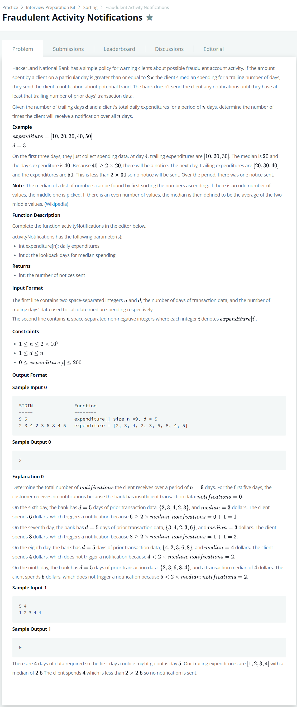

# [Fraudulent Activity Notifications](https://www.hackerrank.com/challenges/fraudulent-activity-notifications/problem)




### My Answer

**Failed(2021/11/23)**  

```python
def activityNotifications(expenditure, d):
    freq = {}
    notify=0
    def find(idx):
        total_count = 0
        for i in range(201): 
            if i in freq:
                total_count = total_count + freq[i]
            if total_count >= idx:
                return i
    for i in range(len(expenditure)-1):
        if expenditure[i] in freq:
            freq[expenditure[i]]+=1
        else:
            freq[expenditure[i]]=1
        #print(f"i: {i},val: {expenditure[i]}, freq: {freq}")
        if i>=d-1:
            if d%2 ==0:
                median = (find(d//2)+find(d//2+1))/2
            else:
                median = find(d/2)
            #print("median: ",median)
            if expenditure[i+1]>= (median*2) :
                notify +=1
                print("notify: ",notify)
            #remove the previous element from dictionary
            freq[expenditure[i-d+1]]-=1

    return notify    
```

* Time Complexity : O(n)
* Space Complexity : O(2n)


### The things I got

변수 값의 범위를 보고 시간 복잡도, 공간 복잡도를 생각하자  

이번 경우에는 counting_value을 m으로 둬서 n*m 시간 복잡도가 나올거라 생각해서 방법을 포기했는데, 최댓값이 200까지 였기 때문에 사실상 n x 200이었음  

+ **Counting Sort도 기억해두자**  