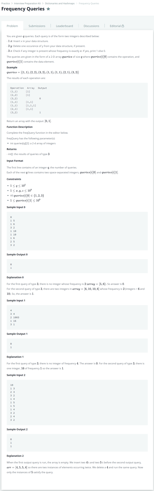

# [Frequency Queries](https://www.hackerrank.com/challenges/frequency-queries/problem)




### My Answer

```python
def freqQuery(queries):
    freq = defaultdict(int)
    count_dict = defaultdict(int)
    result = []
    
    for query in queries : 
        operation, data = query
        if operation==1 : 
            if freq[data]>0 :  
                count_dict[freq[data]]-=1
            freq[data]+=1
            count_dict[freq[data]]+=1
        elif operation==2 : 
            if freq[data]>0 : 
                count_dict[freq[data]]-=1
                freq[data]-=1
                if freq[data]!=0 : 
                    count_dict[freq[data]]+=1
        elif operation==3 : 
            if count_dict[data]!=0 : 
                result.append(1)
            else : 
                result.append(0)
        else : 
            raise(Exception("Wrong operation type!")) 
            
    return result
```

* Time Complexity : O(n)
* Space Complexity : O(2n)


### The things I got
