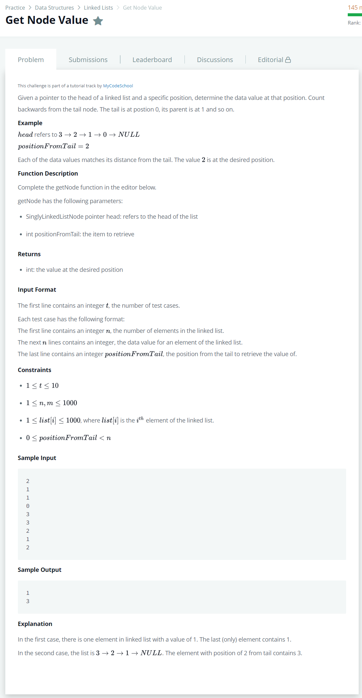

# [Get Node Value](https://www.hackerrank.com/challenges/get-the-value-of-the-node-at-a-specific-position-from-the-tail/problem)




### My Answer

```python
def getNode(llist, positionFromTail):
    history = []
    while llist:
        history.append(llist.data)
        llist = llist.next
        
    return history[::-1][positionFromTail]
```

* Time Complexity : O(n)
* Space Complexity : O(n)


### The things I got
