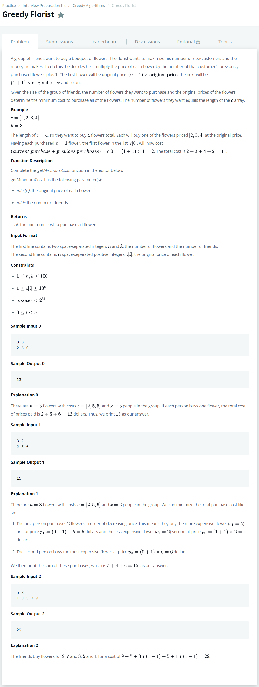

# [Greedy Florist](https://www.hackerrank.com/challenges/greedy-florist/problem)




### My Answer

```python
from queue import Queue

def getMinimumCost(k, c):
    q = Queue()
    for x in sorted(c, reverse=True) : 
        q.put(x)
    weight = 0
    total = 0
    while q.qsize() : 
        for _ in range(k) : 
            if q.qsize()==0 : return total
            total += (weight+1)*q.get()
        weight+=1
    return total
```

* Time Complexity : O(n)
* Space Complexity : O(n)


### The things I got
