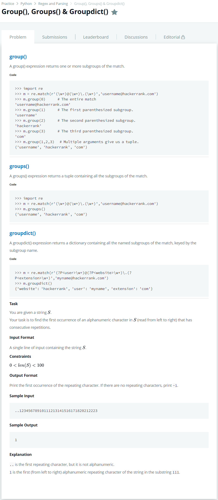

# [Group(), Groups() & Groupdict()](https://www.hackerrank.com/challenges/re-group-groups/problem)




### My Answer

```python
import re
p = re.search(r'([a-zA-Z0-9])\1+',input())
print(p.group(1) if p else -1)
```

* Time Complexity : O(1)
* Space Complexity : O(1)


### The things I got
