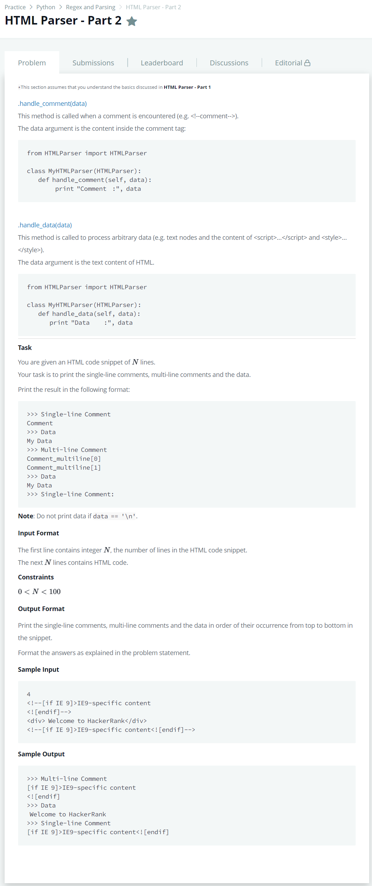

# [HTML Parser - Part 2](https://www.hackerrank.com/challenges/html-parser-part-2/problem)




### My Answer

```python
from html.parser import HTMLParser

class MyHTMLParser(HTMLParser):
    def handle_comment(self, data):
        num = len(data.split('\n'))
        if num>1:
            print('>>> Multi-line Comment')
        else:
            print('>>> Single-line Comment')
        if data.strip():
            print(data)

    def handle_data(self, data):
        if data.strip() : 
            print (">>> Data\n"+str(data))

html = ""       
for i in range(int(input())):
    html += input().rstrip()
    html += '\n'
    
parser = MyHTMLParser()
parser.feed(html)
parser.close()

```

* Time Complexity : O(1)
* Space Complexity : O(1)


### The things I got
