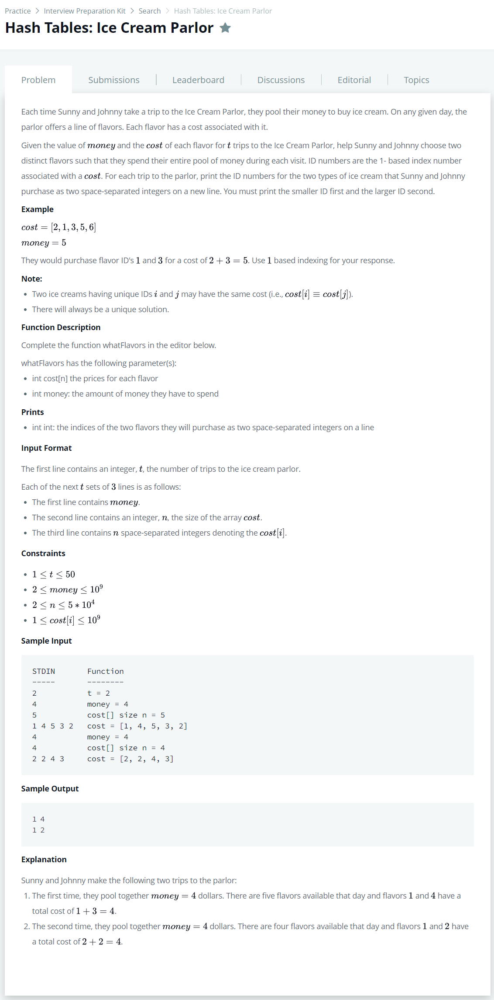

# [Hash Tables : Ice Cream Parlor](https://www.hackerrank.com/challenges/ctci-ice-cream-parlor/problem)




### My Answer

```python
from collections import defaultdict

def whatFlavors(cost, money):
    cost_index = defaultdict(int)
    for i in range(len(cost)) : 
        if cost_index[money-cost[i]]==0 :
            cost_index[cost[i]]=i+1
        else : 
            print(*sorted([cost_index[money-cost[i]],i+1]))
            break
```

* Time Complexity : O(n)
* Space Complexity : O(n)


### The things I got
