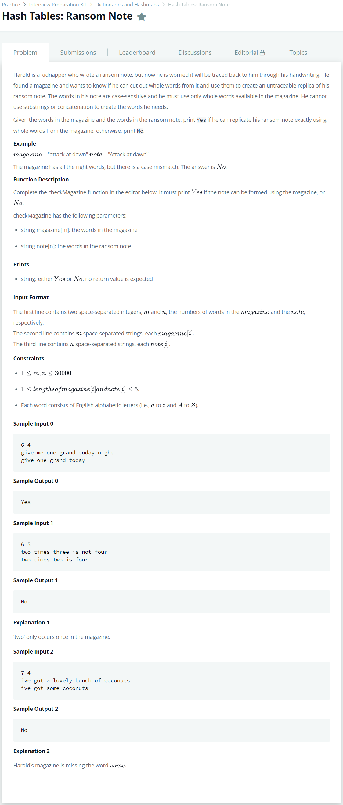

# [Hash Tables : Ransom Note](https://www.hackerrank.com/challenges/ctci-ransom-note/problem?h_l=interview&playlist_slugs%5B%5D=interview-preparation-kit&playlist_slugs%5B%5D=dictionaries-hashmaps)




### My Answer

```python
from collections import defaultdict

def checkMagazine(magazine, note):
    hashmap = defaultdict(int)
    for m in magazine : 
        hashmap[m]+=1
    
    for n in note : 
        if hashmap[n]==0 : 
            print('No')
            return -1
        else : 
            hashmap[n]-=1
    print('Yes')
```

* Time Complexity : O(2n)
* Space Complexity : O(2n)


### The things I got
