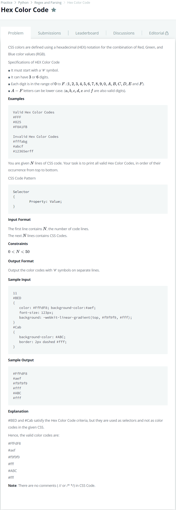

# [Hex Color Code](https://www.hackerrank.com/challenges/hex-color-code/problem)




### My Answer

```python
import re
base = ''.join([input() for _ in range(int(input()))])
p = re.compile('#[a-fA-F0-9]+[;,)]')
for x in p.findall(base) : 
    print(x[:-1])
```

* Time Complexity : O(n)
* Space Complexity : O(n)


### The things I got
