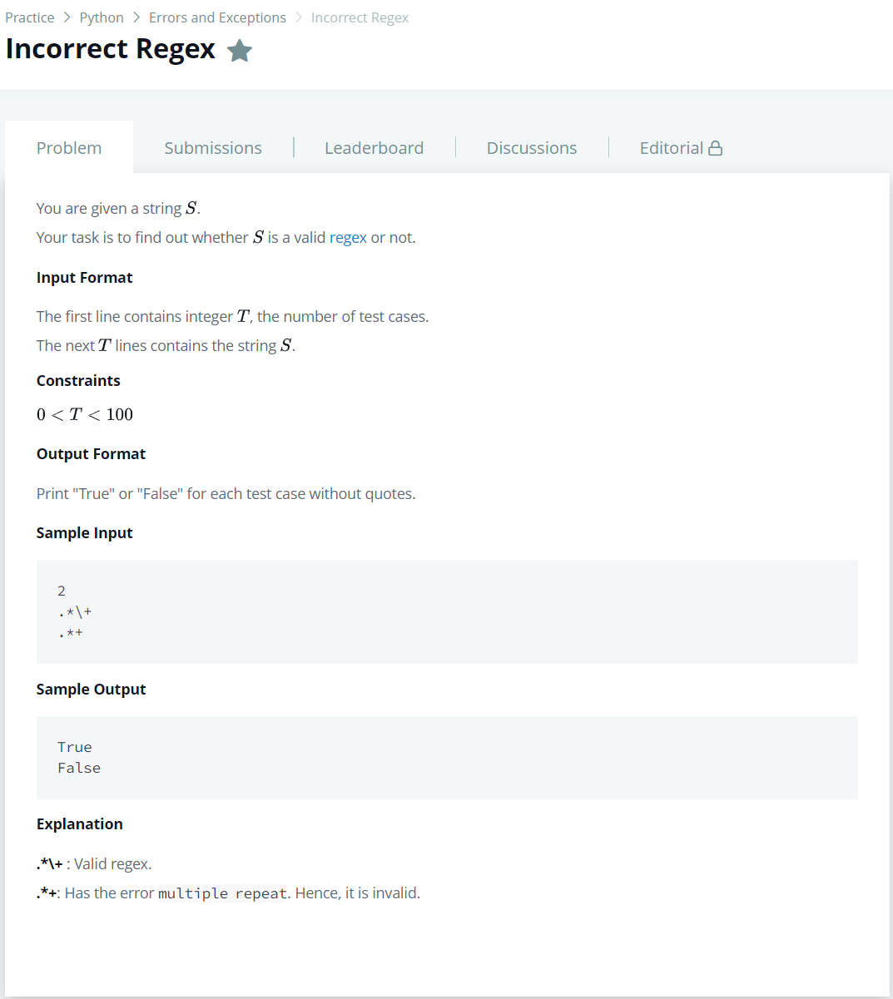

# [Incorrect Regex](https://www.hackerrank.com/challenges/incorrect-regex/problem)




### My Answer

```python
import re
for _ in range(int(input())):
    ans = True
    try:
        reg = re.compile(input())
    except re.error:
        ans = False
    print(ans)
```

* Time Complexity : O(n)
* Space Complexity : O(1)


### The things I got
