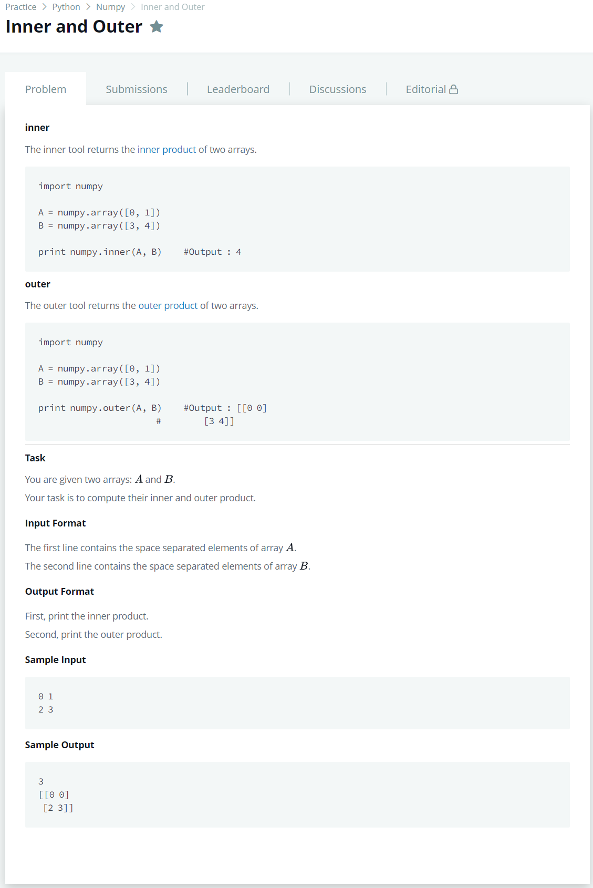

# [Inner and Outer](https://www.hackerrank.com/challenges/np-inner-and-outer/problem)




### My Answer

```python
import numpy as np

A = np.array([int(x) for x in input().split(' ')])
B = np.array([int(x) for x in input().split(' ')])

print(np.inner(A,B))
print(np.outer(A,B))
```

* Time Complexity : O(1)
* Space Complexity : O(1)


### The things I got
