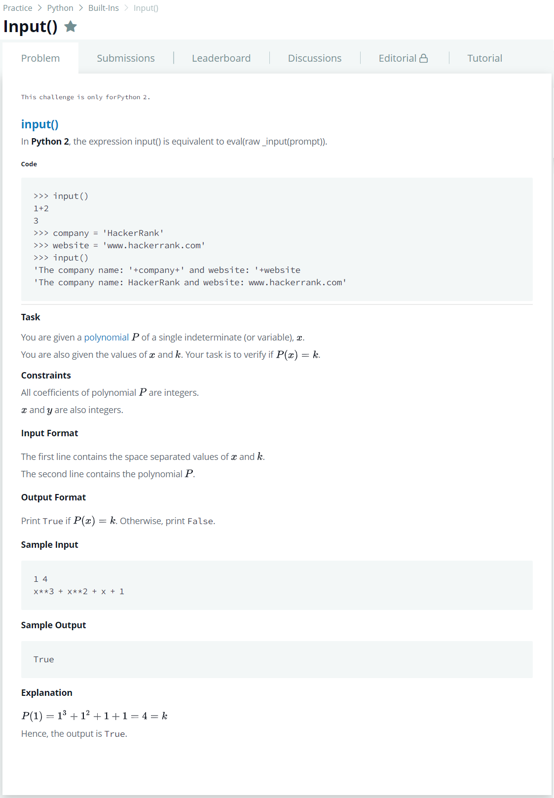

# [Input()](https://www.hackerrank.com/challenges/input/problem)




### My Answer

```python
x,k = list(map(lambda x : int(x), input().split(' ')))
poly = lambda x : eval(input())
print(poly(x)==k)
```

* Time Complexity : O(1)
* Space Complexity : O(1)


### The things I got
