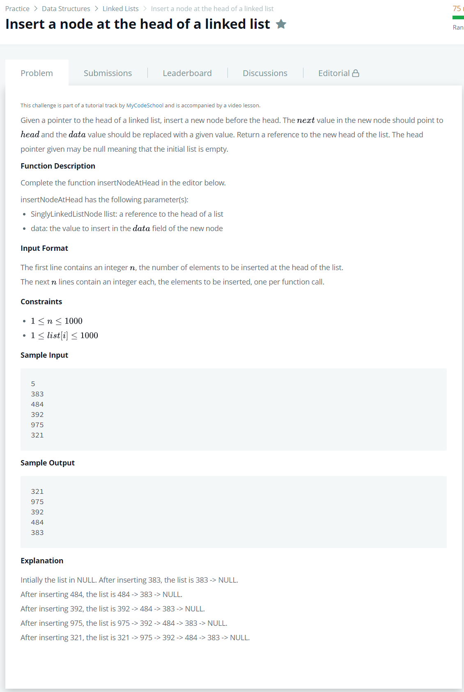

# [Insert Node At The Head Of A Linked List](https://www.hackerrank.com/challenges/insert-a-node-at-the-head-of-a-linked-list/problem)




### My Answer

```python
def insertNodeAtHead(llist, data):   
    if llist == None : 
        llist = SinglyLinkedListNode(data)
        return llist
    else : 
        temp = SinglyLinkedListNode(data)
        temp.next = llist
        return temp
```

* Time Complexity : O(n)
* Space Complexity : O(n)


### The things I got
