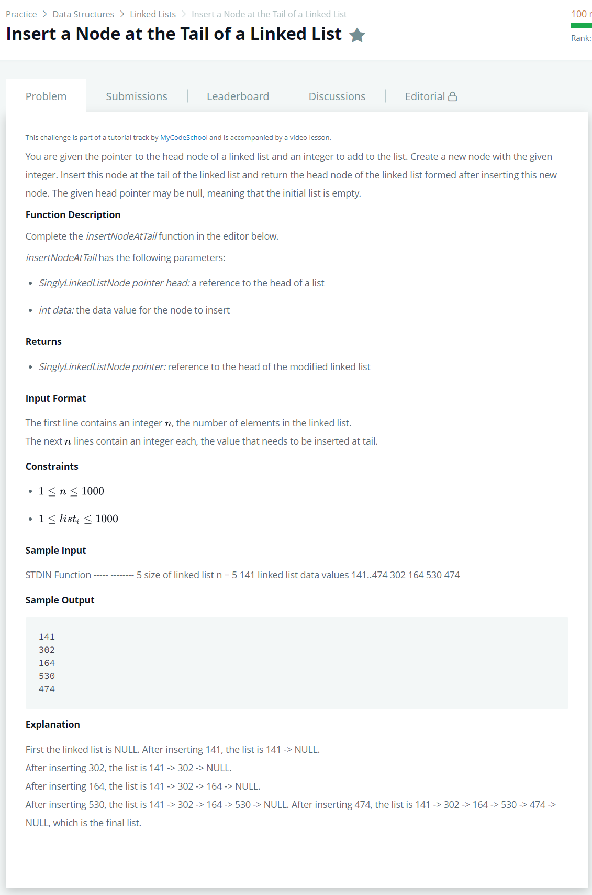

# [Insert a Node at the Tail of a Linked List](https://www.hackerrank.com/challenges/insert-a-node-at-the-tail-of-a-linked-list/problem)




### My Answer

```python
def insertNodeAtTail(head, data):
    if head==None : 
        return SinglyLinkedListNode(data)
    temp=head
    while temp.next!=None:
        temp=temp.next
    temp.next=SinglyLinkedListNode(data)
    return head
```

* Time Complexity : O(nlogn)
* Space Complexity : O(n)


### The things I got
