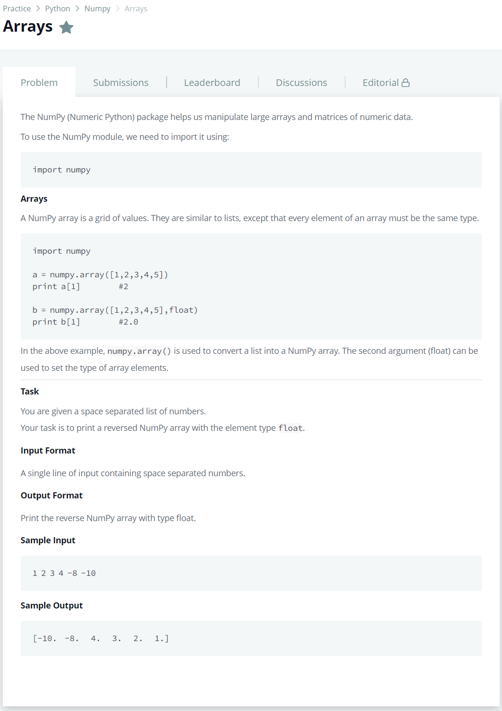

# [Inserting a Node Into a Sorted Doubly Linked List](https://www.hackerrank.com/challenges/insert-a-node-into-a-sorted-doubly-linked-list/problem)




### My Answer

```python
def sortedInsert(llist, data):
    head = llist
    while head : 
        if head.data > data : 
            insertNode = DoublyLinkedListNode(data)
            if head==llist : 
                insertNode.next = head
                head.prev=insertNode
                return insertNode
            else : 
                head.prev.next=insertNode
                insertNode.prev=head.prev
                insertNode.next=head
                head.prev=insertNode
            return llist
        else : 
            if head.next==None : 
                break
            else : 
                head = head.next
    
    insertNode = DoublyLinkedListNode(data)
    insertNode.next = head.next
    insertNode.prev = head
    head.next = insertNode
    
    return llist
```

* Time Complexity : O(n)
* Space Complexity : O(n)


### The things I got
