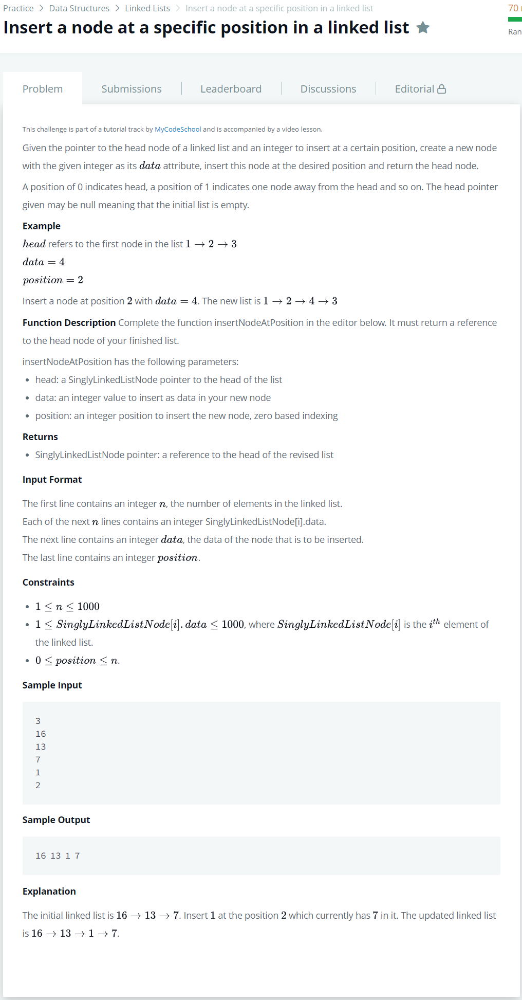

# [Insert node At Specific Position In A linked list](https://www.hackerrank.com/challenges/insert-a-node-at-a-specific-position-in-a-linked-list/problem)




### My Answer

```python
def insertNodeAtPosition(llist, data, position):
    head = llist
    for i in range(position-1) : 
        head = head.next
    temp = head.next
    head.next = SinglyLinkedListNode(data)
    head.next.next = temp
    return llist
```

* Time Complexity : O(n)
* Space Complexity : O(n)


### The things I got
