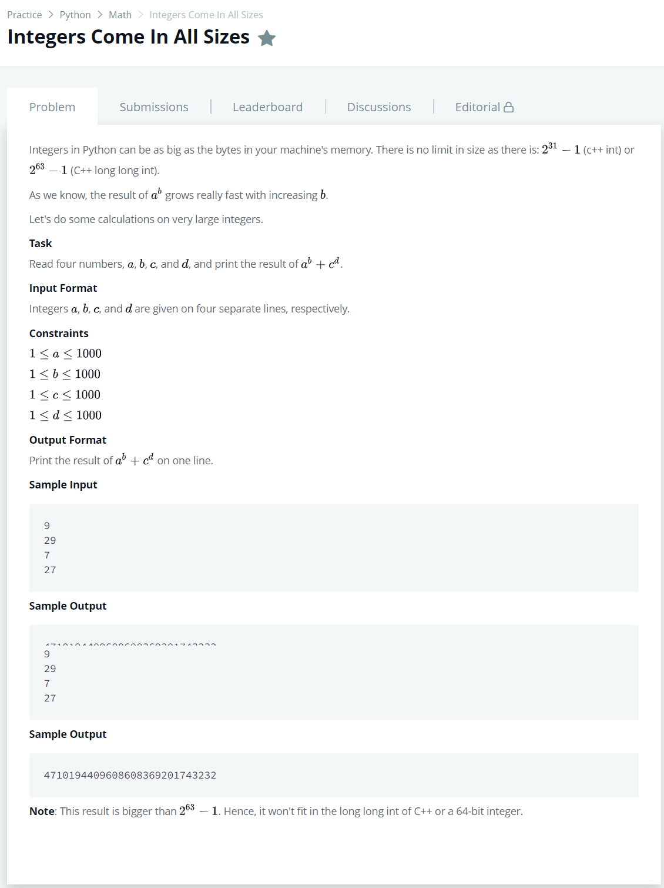

# [IntegersComeInAllSizes](https://www.hackerrank.com/challenges/python-integers-come-in-all-sizes/problem)




### My Answer

```python
a,b,c,d = (int(input()) for _ in range(4))
print (pow(a,b)+pow(c,d))
```

* Time Complexity : O(n)
* Space Complexity : O(n)


### The things I got
