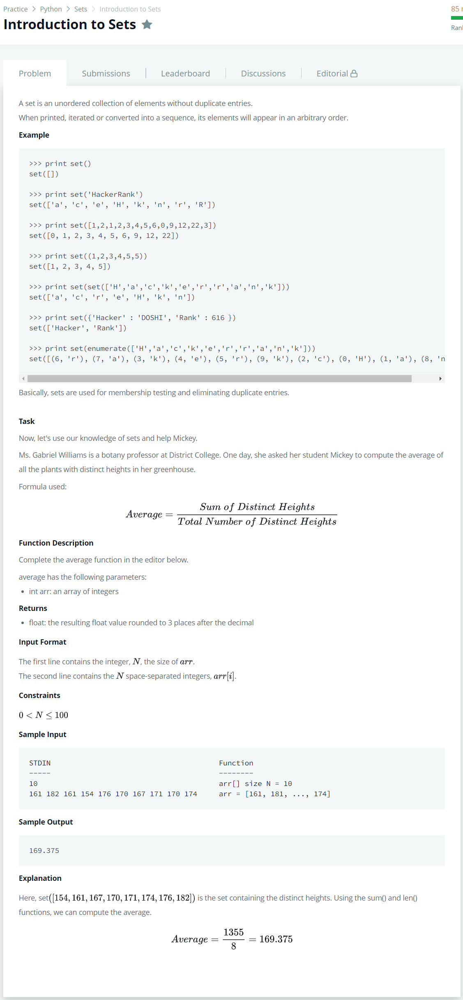

# [Introduction to sets](https://www.hackerrank.com/challenges/py-introduction-to-sets/problem)




### My Answer

```python
def average(array):
    s = set(array)
    return float('%.3f' %(sum(s)/len(s)))
```

* Time Complexity : O(1)
* Space Complexity : O(1)


### The things I got
