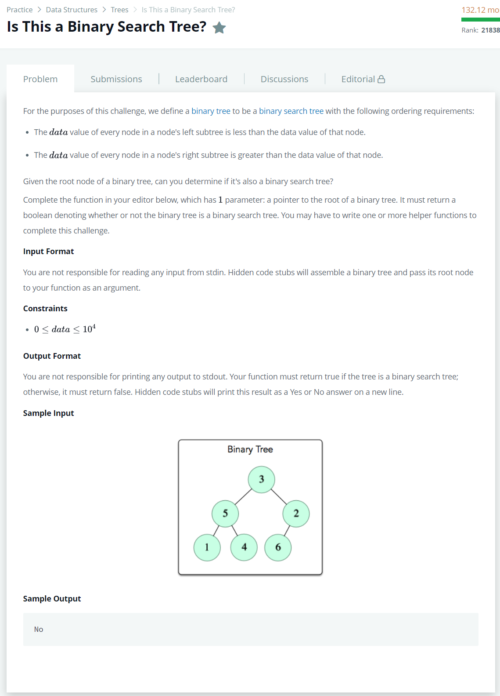

# [Is This a Binary Search Tree?](https://www.hackerrank.com/challenges/is-binary-search-tree/problem)




### My Answer

```python
def checkMinMaxBST(root,min,max) : 
    left_result,right_result = True, True
    if root.left :
        if root.left.data < root.data and root.left.data > min : 
            left_result = checkMinMaxBST(root.left,min,root.data) 
        else : 
            return False
    if root.right : 
        if root.right.data > root.data and root.right.data < max : 
            right_result = checkMinMaxBST(root.right,root.data,max) 
        else : 
            return False
        
    return left_result and right_result


def check_binary_search_tree_(root):
    return checkMinMaxBST(root,-1,10001)
```

* Time Complexity : O(logn)
* Space Complexity : O(n)


### The things I got
