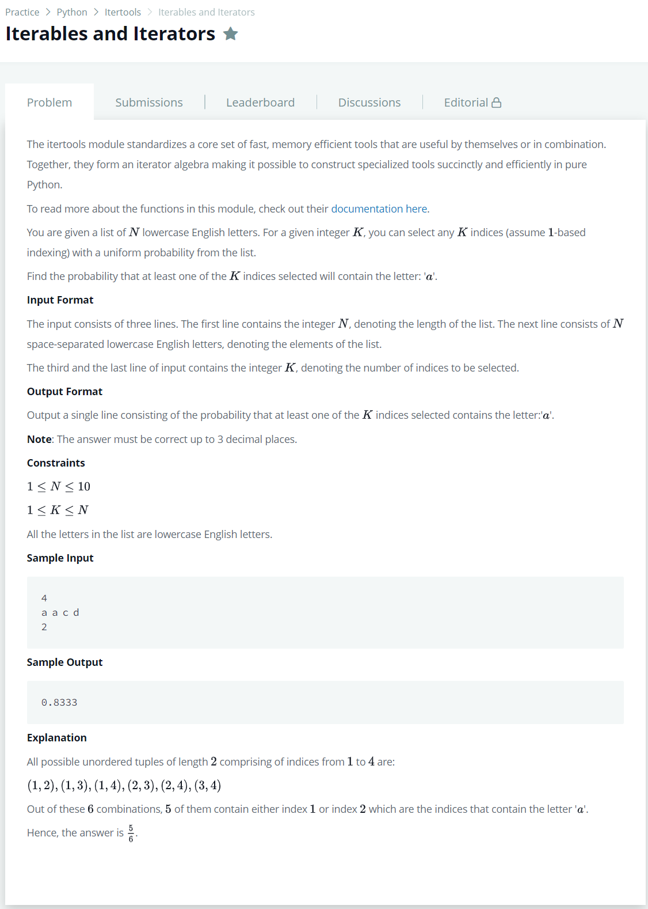

# [Iterables and Iterators](https://www.hackerrank.com/challenges/iterables-and-iterators/problem)




### My Answer

```python
from itertools import combinations

n, letters = input(), input().replace(' ','')
length = int(input())
comb = tuple(combinations(letters,length))
print(sum(['a' in x for x in comb])/len(comb))
```

* Time Complexity : O(2n)
* Space Complexity : O(n)


### The things I got
