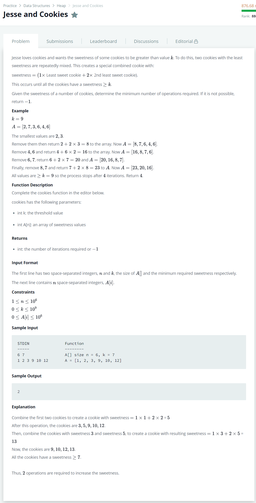

# [Jesse And Cookies](https://www.hackerrank.com/challenges/jesse-and-cookies/problem)




### My Answer

```python
from heapq import heapify, heappop, heappush

def cookies(k, A):
    count = 0
    heapify(A)
    while A[0] < k and len(A) > 1:
        heappush( A, heappop(A) + 2 * heappop(A) )
        count += 1
    
    return count if A[0] >= k else -1
```

* Time Complexity : O(logn)
* Space Complexity : O(n)


### The things I got

그냥 sorting으로 풀어보려다가 망했는데, HEAP을 쓰면 최솟값을 계속 갱신해야 하는 문제를 수월하게 풀 수 있다.