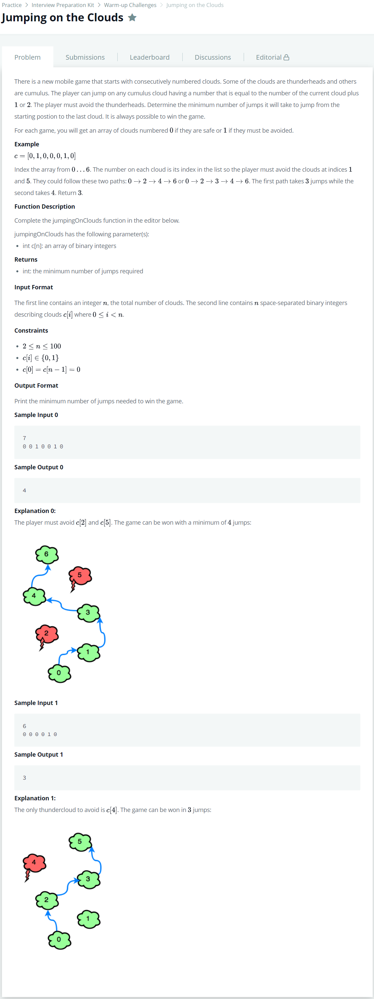

# [Jumping On The Clouds](https://www.hackerrank.com/challenges/jumping-on-the-clouds/problem?h_l=interview&playlist_slugs%5B%5D=interview-preparation-kit&playlist_slugs%5B%5D=warmup)




### My Answer

```python
def jumpingOnClouds(c):
    count=0
    flag=0
    c2 = c+[1]
    for i in range(len(c)-1) : 
        if flag : 
            flag=0
            continue
        else : 
            if(c2[i+2]==0) : 
                count+=1
                flag=1
            else : 
                count+=1
                
    return count
```

* Time Complexity : O(n)
* Space Complexity : O(1)


### The things I got

