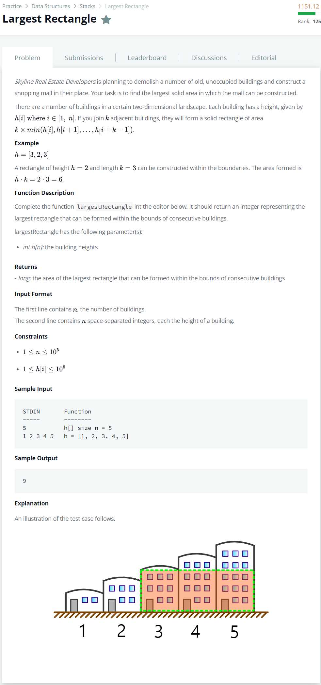

# [Largest Rectangle](https://www.hackerrank.com/challenges/largest-rectangle/problem)




### My Answer

```python
def rangeArray(heights, stack, i, dest_arr) : 
    while len(stack) and heights[i] < heights[stack[-1]] :
        top = stack.pop()
        dest_arr[top] = i
    stack.append(i)


def largestRectangle(h):
    stack = []
    left_arr, right_arr = [-1 for _ in range(len(h))],[len(h) for _ in range(len(h))]
    
    for i in range(len(h)) : 
        rangeArray(h,stack,i,right_arr)
    
    for j in range(len(h)-1,-1,-1) : 
        rangeArray(h,stack,j,left_arr)
    
    maximum_area = 0
    for k in range(len(h)) : 
        maximum_area = max(maximum_area,h[k] * (right_arr[k]-left_arr[k]-1))
    
    return maximum_area
```

* Time Complexity : O(3n)
* Space Complexity : O(2n)


### The things I got

[Largest Rectangle 문제 해설](https://withhamit.tistory.com/523)  

이걸 무슨 알고리즘이라해야될지 모르겠다. 이전 값들과 비교할 때 nlogn -> n 알고리즘이라해야되나..  

아무튼 stack을 사용해서 해당 조건에 맞으면 pop. 아니면 push를 해서 값을 임시저장해두는 느낌.  

어디에서 사용해야할지는 아직 감이 오지 않는다. 이를 이용한 문제가 있으면 아래에 추가 할 예정  

- [Reverse Shuffle Merge](../ReverseShuffleMerge/ReverseShuffleMerge.md)  

