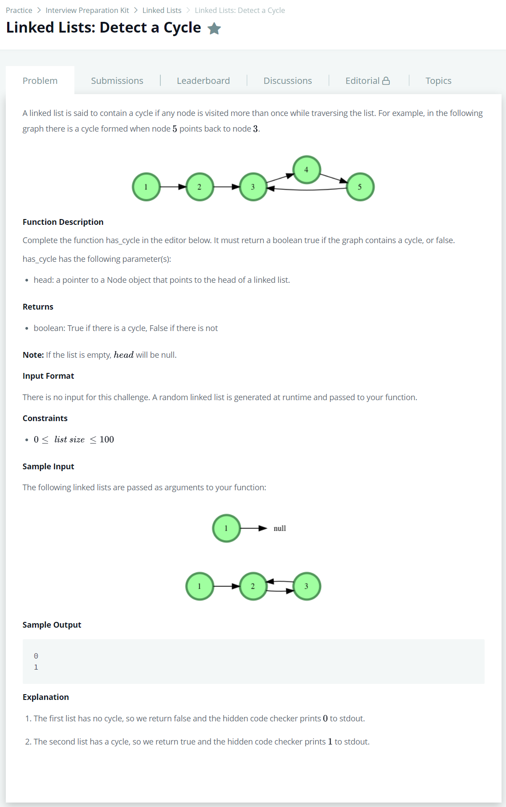

# [Linked Lists : Detect a Cycle](https://www.hackerrank.com/challenges/ctci-linked-list-cycle/problem)




### My Answer

```python
def has_cycle(head):
    for i in range(101) : 
        if head.next : 
            head = head.next
        else : 
            return 0
    return 1
```

* Time Complexity : O(1)
* Space Complexity : O(1)


### The things I got
