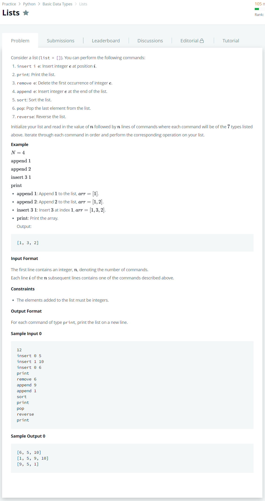

# [Lists](https://www.hackerrank.com/challenges/python-lists/problem)




### My Answer

```python
if __name__ == '__main__':
    N = int(input())
    
    result = []
    for _ in range(N) : 
        command,*parameter = input().split(' ')
        if command == 'print' : print(result)
        else : eval('result.{}({})'.format(command,','.join(parameter)))

```

* Time Complexity : O(n)
* Space Complexity : O(n)


### The things I got

eval 함수는... 웬만하면 쓰지말자 (보안문제) -> getattr사용