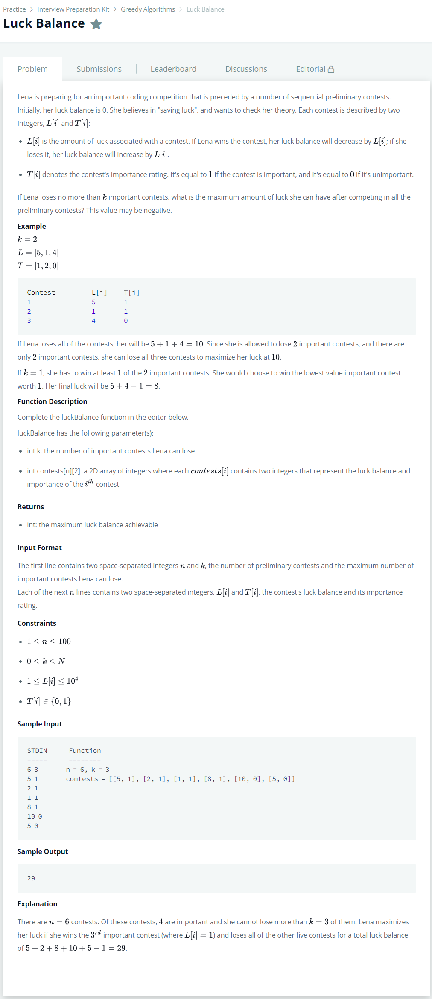

# [Luck Balance](https://www.hackerrank.com/challenges/luck-balance/problem)




### My Answer

```python
def luckBalance(k, contests): 
    prob = 0
    for contest in sorted(contests,reverse=True):
        if contest[1] == 0:
            prob += contest[0]
        elif k > 0:
            prob += contest[0]
            k -= 1
        else:
            prob -= contest[0]
    return prob
```

* Time Complexity : O(n)
* Space Complexity : O(n)


### The things I got
