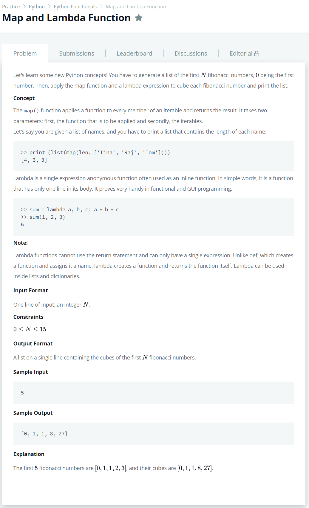

# [Map and Lambda function](https://www.hackerrank.com/challenges/map-and-lambda-expression/problem)




### My Answer

```python
cube = lambda x: x**3

def fibonacci(n) : 
    output = []
    for i in range(n) : 
        if i==0 : output.append(0)
        elif i==1 : output.append(1)
        else : output.append(output[i-2]+output[i-1])
    return output
```

* Time Complexity : O(n)
* Space Complexity : O(n)


### The things I got
