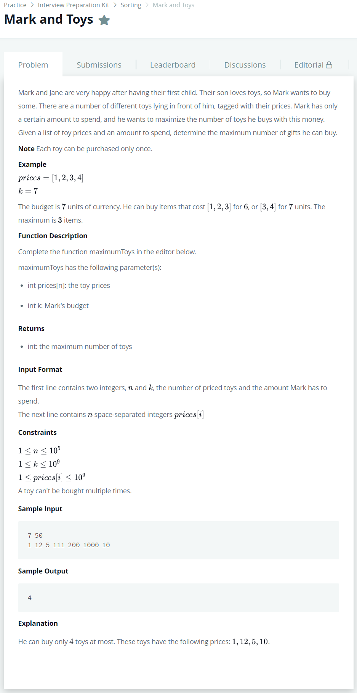

# [Mark and Toys](https://www.hackerrank.com/challenges/mark-and-toys/problem?h_l=interview&playlist_slugs%5B%5D=interview-preparation-kit&playlist_slugs%5B%5D=sorting)




### My Answer

```python
def maximumToys(prices, k):
    prices.sort()
    price_sum = 0
    count=0
    for x in sorted(prices) :
        price_sum+=x
        count+=1
        if price_sum>k : break
    return count-1
```

* Time Complexity : O(n)
* Space Complexity : O(n)


### The things I got
