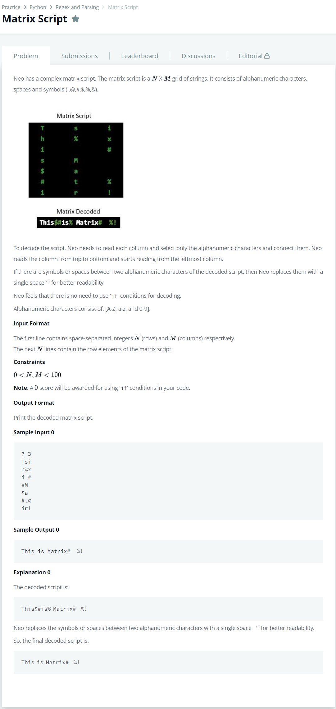

# [Matrix Script](https://www.hackerrank.com/challenges/matrix-script/problem)




### My Answer

```python
import math
import os
import random
import re
import sys

first_multiple_input = input().rstrip().split()

n = int(first_multiple_input[0])

m = int(first_multiple_input[1])

matrix = []

for _ in range(n):
    matrix_item = input()
    matrix.append(matrix_item)

script = ''.join([''.join([matrix[y][x] for y in range(n)]) for x in range(m)])
for k in re.findall(r'[A-Za-z0-9][^A-Za-z0-9]+[A-Za-z0-9]',script) : 
    script = script.replace(k,k[0]+' '+k[-1])
print(script)
```

* Time Complexity : O(n)
* Space Complexity : O(n)


### The things I got
