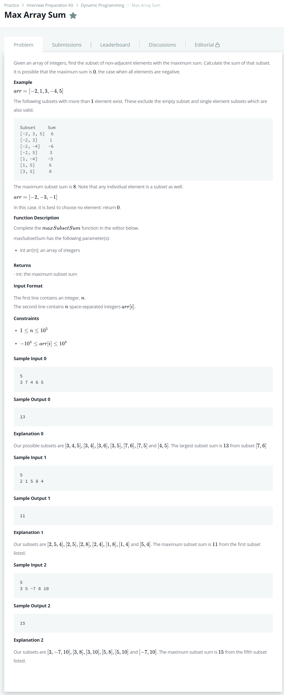

# [Max Array Sum](https://www.hackerrank.com/challenges/max-array-sum/problem)




### My Answer

```python
def maxSubsetSum(arr):
    dp = {} 
    dp[0], dp[1] = arr[0], max(arr[0], arr[1])
    for i, x in enumerate(arr[2:], start=2):
        dp[i] = max(dp[i-1], dp[i-2]+x, dp[i-2], x)
    return dp[len(arr)-1]    
```

* Time Complexity : O(n)
* Space Complexity : O(n)


### The things I got

1-Array Dynamic Programming이다. 고정관념으로 2차원의 DP만 생각하고 있었는데, 이런 식으로도 참고할 수 있다는걸 유의하자  