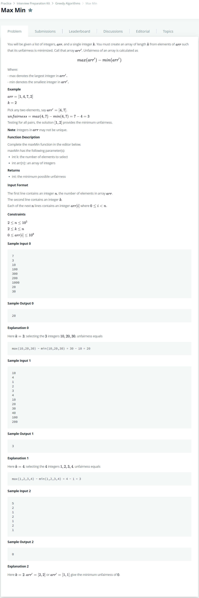

# [Max Min](https://www.hackerrank.com/challenges/angry-children/problem)




### My Answer

```python
def maxMin(k, arr):
    prime = sorted(arr)
    minimum = 10**9+1
    for i in range(k-1,len(prime)) : 
        if prime[i]-prime[i-k+1] < minimum : 
            minimum = prime[i]-prime[i-k+1]
    return minimum
```

* Time Complexity : O(nlogn)
* Space Complexity : O(n)


### The things I got
