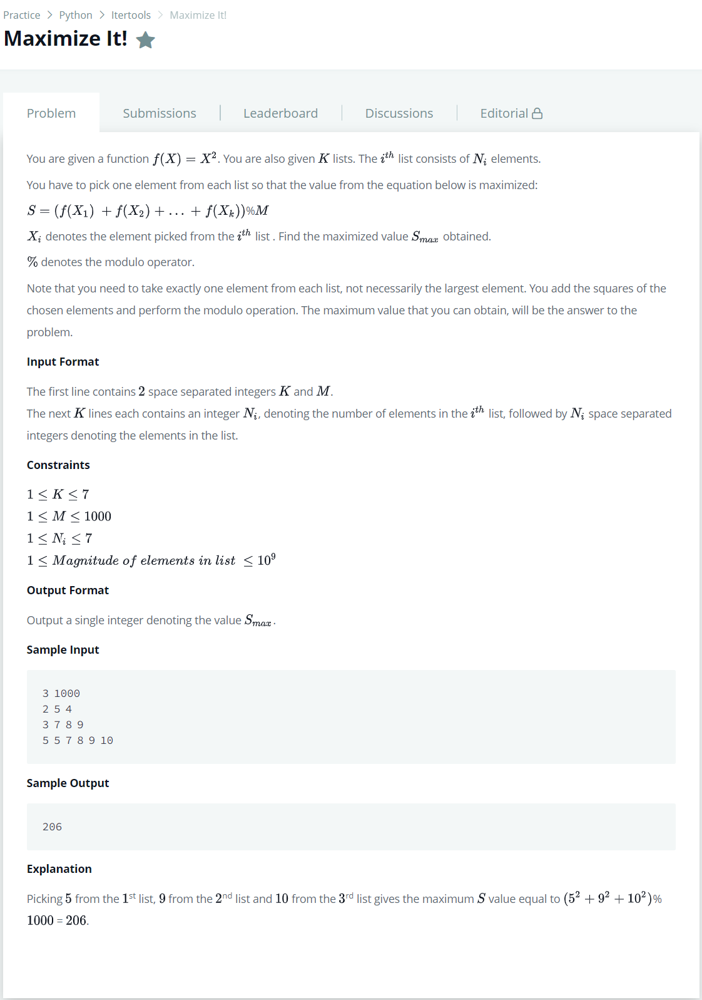

# [Maximize It!](https://www.hackerrank.com/challenges/maximize-it/problem)




### My Answer

```python
K, M = map(lambda x : int(x),input().split())
temp = [0]

for k in range(K) : 
    N = [int(o)**2 for o in input().split()[1:]]
    stack = temp[:]
    temp = []
    for s in stack : 
        for n in N : 
            temp.append(s+n)

print(max([x%M for x in temp]))
```

* Time Complexity : O(n)
* Space Complexity : O(n)


### The things I got
