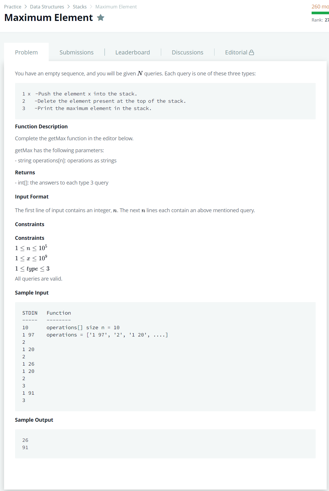

# [Maximum Element](https://www.hackerrank.com/challenges/maximum-element/problem)




### My Answer

```python
def getMax(operations):
    stack = []
    result = []
    maximum = 0
    second = 0
    for o in operations : 
        if o[0]=='1' : 
            stack.append(int(o[2:]))
            if int(o[2:]) > maximum : 
                second = maximum
                maximum = int(o[2:])
        elif o[0]=='2' : 
            poped = stack.pop()
            if poped == maximum : 
                maximum = second
        else : 
            if maximum==second : 
                result.append(max(stack))
            else : 
                result.append(maximum)
    return result
```

* Time Complexity : O(n)
* Space Complexity : O(n)


### The things I got
