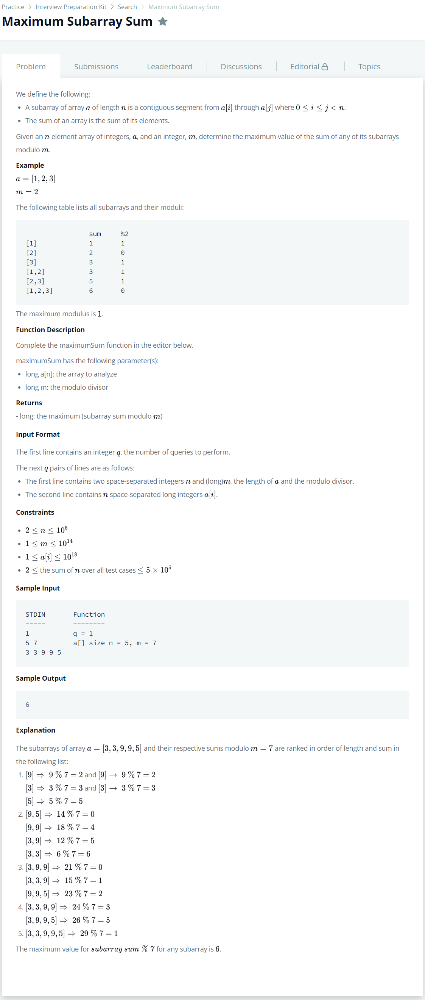

# [Maximum Subarray Sum](https://www.hackerrank.com/challenges/maximum-subarray-sum/problem)




### My Answer

```python
def maximumSum(a, m):
    max = 0
    for i in range(1,len(a)+1) : 
        temp_sum = sum(a[:i])
        if temp_sum%m>max : 
                max = temp_sum%m
        for j in range(i,len(a)) : 
            temp_sum -= a[j-i]
            temp_sum += a[j]
            if temp_sum%m>max : 
                max = temp_sum%m
    return max
```

* Time Complexity : O(nlogn)
* Space Complexity : O(1)


### The things I got

naiive 풀이방법 : nlog(n)  

n으로 끝낼 방법을 찾아야한다.  

단서1번) subarray가 붙어있다. subset개념이 아님.  

단서2번) m이 10^14이므로 modulo list를 만들어서 하는 것도 아님. space complexity에 위반  

단서3번) array에 모두 modulo 연산을 한 다음에 시행해도 결과는 똑같음.  