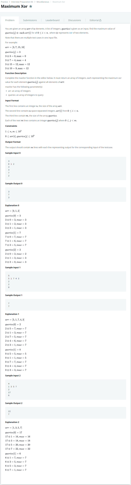

# [Maximum Xor](https://www.hackerrank.com/challenges/maximum-xor/problem)




### My Answer

```python
class Node : 
    def __init__(self) : 
        self.left = None
        self.right = None
        self.data = 'Initial'
        
def addValueTree(Tree,binary,value) : 
    head = Tree
    for b in binary : 
        if b=='0' : 
            if head.left==None : 
                head.left = Node() 
            head=head.left
        else : 
            if head.right==None : 
                head.right = Node()
            head=head.right
    head.data = value

def checkValueTree(Tree,binary) : 
    if len(binary)==0 : 
        return Tree.data
    else : 
        poped = binary.pop(0)
        if poped=='0' and Tree.left : 
            #print('case 1')
            return checkValueTree(Tree.left,binary)
        elif poped=='1' and Tree.right : 
            #print('case 2')
            return checkValueTree(Tree.right,binary)     
        elif Tree.right : 
            #print('case 3')
            return checkValueTree(Tree.right,binary) 
        elif Tree.left : 
            #print('case 4')
            return checkValueTree(Tree.left,binary)
        else : 
            raise(Exception("Error Occur!"))
            
            
def printTree(Tree) : 
    if Tree.left : 
        #rint('0')
        printTree(Tree.left)
    print(Tree.data)
    if Tree.right : 
        #rint('1')
        printTree(Tree.right)
    #print('end')
        
def IntToBin(integer,represent_num) : 
    assert(type(integer)==int)
    format_str = '{0:0>'+str(represent_num)+'b}'
    return format_str.format(int(bin(integer)[2:],2))

def maxBin(represent_num) : 
    return '0b'+'1'*represent_num


def maxXor(arr, queries):
    Tree = Node()
    for x in arr : 
        addValueTree(Tree,IntToBin(x,31),x)
    maxb = maxBin(31)
    results = []
    for q in queries : 
        result = checkValueTree(Tree,list(IntToBin(int(maxb,2)^q,31)))
        print(result^q)
        results.append(result^q)
        
    return results
```

* Time Complexity : O(n+logm)
* Space Complexity : O(n)


### The things I got

Tree로 풀면 log(m)이다. 트리로 푸는 연습을 하자.  