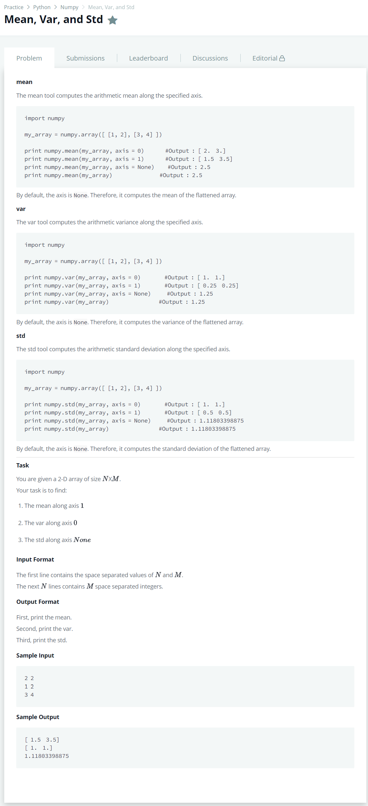

# [Mean, Var, and Std](https://www.hackerrank.com/challenges/np-mean-var-and-std/problem)




### My Answer

```python
import numpy as np

N,M = [int(x) for x in input().split(' ')]

array = np.array([[int(x) for x in input().split(' ')] for _ in range(N)])
print(np.mean(array,axis=1))
print(np.var(array,axis=0))
print(round(np.std(array), 11))
```

* Time Complexity : O(n)
* Space Complexity : O(n)


### The things I got
