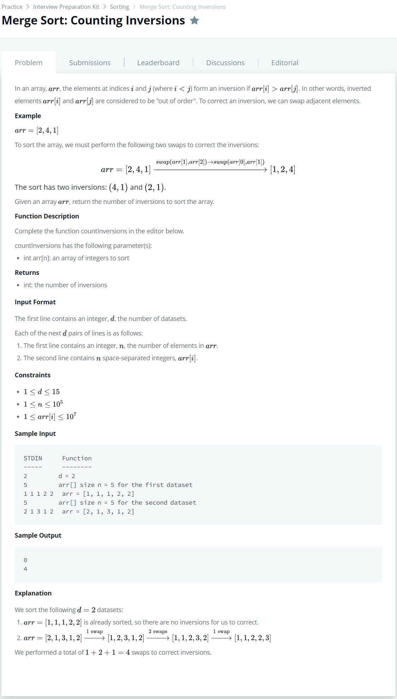

# [Merge Sort : Counting Inversions](https://www.hackerrank.com/challenges/ctci-merge-sort/problem)




### My Answer

```python
def swap(arr,a,b) : 
    temp = arr[a]
    arr[a] = arr[b]
    arr[b] = temp

def mergeSort(arr, i1, i2) : 
    # two item ramains
    if i2-i1==2 : 
        if arr[i1]>arr[i1+1] : #swap
            swap(arr,i1,i1+1)
            return 1
        else : #pass
            return 0
    # one item remain -> pass
    elif i2-i1==1 : 
        return 0
    # merge
    else : 
        mid = i1+(i2-i1+1)//2
        count1 = mergeSort(arr,i1,mid)
        count2 = mergeSort(arr,mid,i2)
        
        left = arr[i1:mid]
        right = arr[mid:i2]
        
        left_head_index = 0
        right_head_index = 0
        
        merge_count=0
        head_index = i1
        while left_head_index < len(left) and right_head_index < len(right) :
            if left[left_head_index] <= right[right_head_index] :
                arr[head_index] = left[left_head_index]
                left_head_index += 1
                head_index += 1
            else : 
                arr[head_index] = right[right_head_index]
                right_head_index += 1
                merge_count += len(left)-left_head_index
                head_index += 1
        
        if left_head_index == len(left) : 
            while right_head_index < len(right) : 
                arr[head_index] = right[right_head_index]
                right_head_index += 1
                merge_count += len(left)-left_head_index
                head_index += 1
        elif right_head_index == len(right) : 
            while left_head_index < len(left) : 
                arr[head_index] = left[left_head_index]
                left_head_index += 1
                head_index += 1
       
        return count1 + count2 + merge_count
    
def countInversions(arr) : 
    return mergeSort(arr,0,len(arr))
```

* Time Complexity : O(nlogn)
* Space Complexity : O(2n)


### The things I got
