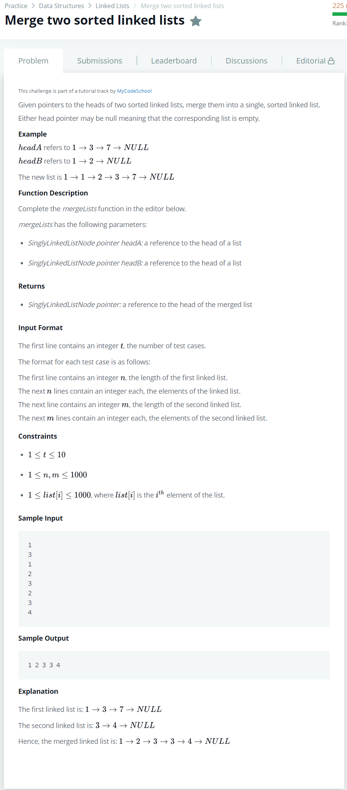

# [Merge Two Sorted Linked Lists](https://www.hackerrank.com/challenges/merge-two-sorted-linked-lists/problem)




### My Answer

```python
def mergeLists(head1, head2):
    if head1 is None:
        return head2
    if head2 is None:
        return head1

    if head1.data <= head2.data:
        head = head1
        curr1 = head1.next
        curr2 = head2
    else:
        head = head2
        curr1 = head1
        curr2 = head2.next

    curr = head
        
    while True:
        if curr1 is None:
            curr.next = curr2
            break
        elif curr2 is None:
            curr.next = curr1
            break

        if curr1.data <= curr2.data:
            curr.next = curr1
            curr1 = curr1.next
        else:
            curr.next = curr2
            curr2 = curr2.next
        
        curr = curr.next

    return head
```

* Time Complexity : O(n)
* Space Complexity : O(n)


### The things I got
