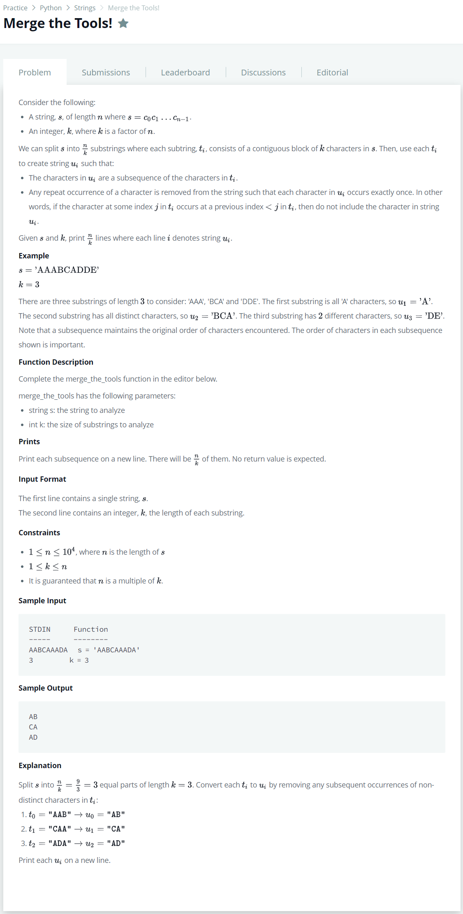

# [Merge the Tools](https://www.hackerrank.com/challenges/nested-list/problem)




### My Answer

```python
def merge_the_tools(string, k):
    for i in range(len(string)/k) : 
        output = ''
        for j in range(k) : 
            if string[k*i+j] in output : continue
            else : output += string[k*i+j]
        print(output)
```

* Time Complexity : O(n)
* Space Complexity : O(1)


### The things I got
