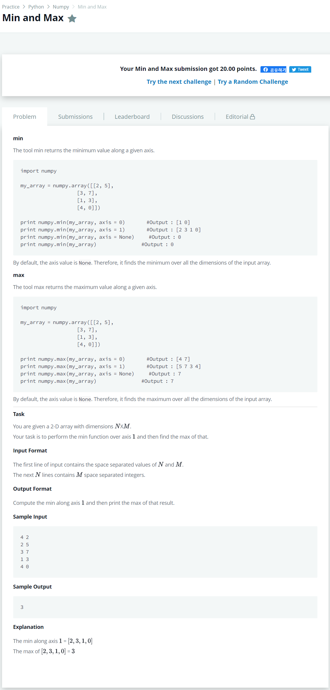

# [Min And Max](https://www.hackerrank.com/challenges/np-min-and-max/problem)




### My Answer

```python
import numpy as np

n, m = list(map(int, (input().split())))
a = np.array([list(map(int,(input().split()))) for i in range(int(n))])
print(np.max(np.min(a, axis = 1), axis = None))
```

* Time Complexity : O(n)
* Space Complexity : O(n)


### The things I got
