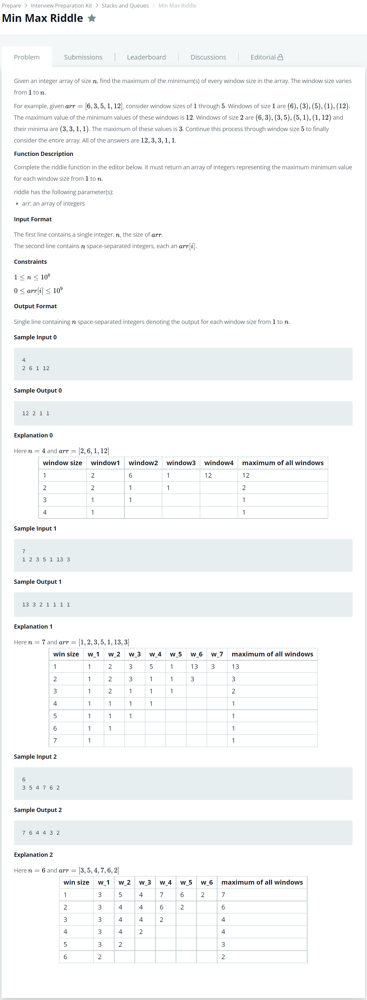

# [Min Max Riddle](https://www.hackerrank.com/challenges/min-max-riddle/problem)




### My Answer

```python
def riddle(arr):
    
    result = []
    
    #first
    first = max(arr)
    result.append(first)
    
    #second
    second = []
    for i in range(len(arr)-1) : 
        second.append(min(arr[i],arr[i+1]))
    result.append(max(second))
        
    #others
    target = second
    for size in range(3,len(arr)) : 
        target = [min(target[i],target[i+1]) for i in range(len(target)-1)]
        result.append(max(target))
            
    #last
    result.append(min(arr))
    
    return result
```

* Time Complexity : O(n^2)
* Space Complexity : O(n)


### The things I got

nlogn이 나올줄 알았는데 생각해보니까 n, n-1, n-2 식으로 줄어드는거라 n^2이었다. window size를 줄여가며 하나씩 계산하는게 문제가 아닌듯  