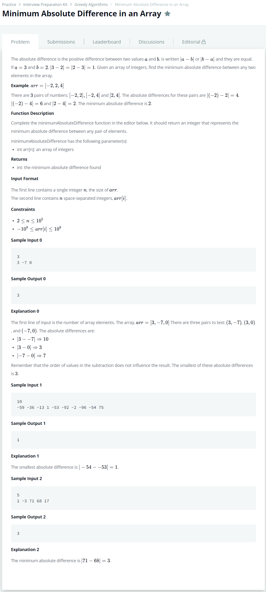

# [Minimum Absolute Difference In an Array](https://www.hackerrank.com/challenges/minimum-absolute-difference-in-an-array/problem)




### My Answer

```python
def minimumAbsoluteDifference(arr):
    arr.sort()
    min_difference=2*(10**9)
    for i in range(1,len(arr)) : 
        if abs(arr[i]-arr[i-1])<min_difference : 
            min_difference = abs(arr[i]-arr[i-1])
    return min_difference
```

* Time Complexity : O(nlog(n))
* Space Complexity : O(1)


### The things I got
