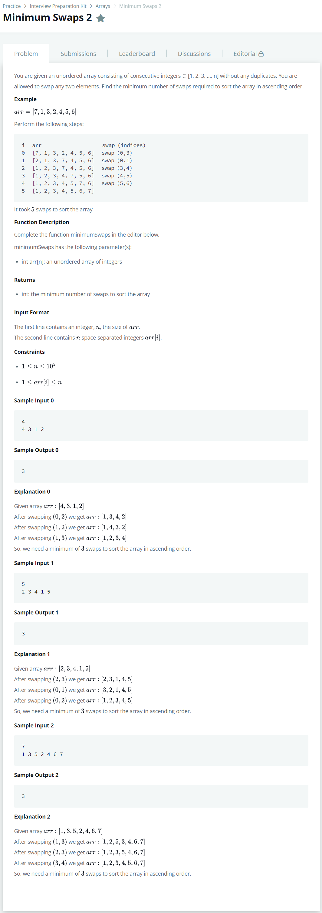

# [Minimum Swaps 2](https://www.hackerrank.com/challenges/minimum-swaps-2/problem?h_l=interview&playlist_slugs%5B%5D=interview-preparation-kit&playlist_slugs%5B%5D=arrays)




### My Answer

```python
def minimumSwaps(arr):
    count=0
    for x in range(len(arr)) : 
        while arr[x]!=x+1 : 
            temp = arr[x]-1
            arr[x],arr[temp]=arr[temp],arr[x]
            count+=1
    return count
```

* Time Complexity : O(n)
* Space Complexity : O(1)


### The things I got
