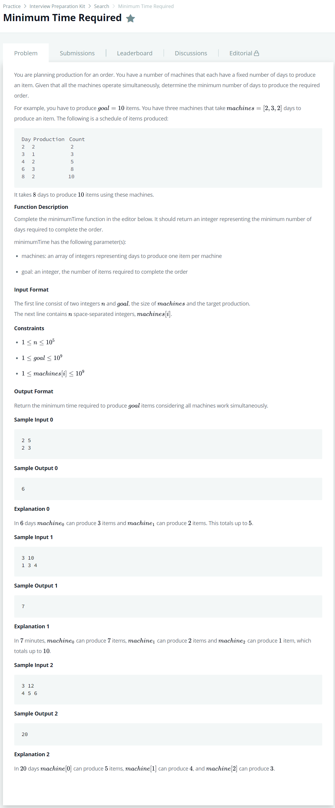

# [Minimum Time Required](https://www.hackerrank.com/challenges/minimum-time-required/problem)




### My Answer

```python
def minTime(machines, goal):
    if goal < len(machines) : 
        lower_bound = min(machines)
        upper_bound = max(machines)
    else :  
        lower_bound = goal // len(machines) * min(machines)
        upper_bound = goal // len(machines) * max(machines) + 1
    
    while lower_bound < upper_bound :
        mid_bound = (lower_bound+upper_bound)//2
        total = getTotal(machines, mid_bound)
        if total >= goal : 
            upper_bound = mid_bound
        else : 
            lower_bound = mid_bound+1
    return math.floor(lower_bound)        
        
def getTotal(machines, days) : 
    total = 0
    for machine in machines : 
        total += days // machine
    return total
```

* Time Complexity : O(nlogn)
* Space Complexity : O(1)


### The things I got

양쪽으로 나눠서 (lower bound, upper bound) 줄여나가는 방법. 그리디 알고리즘이라 해야할지.. Merge Sort 느낌도 나고.. 일단 외워두자.