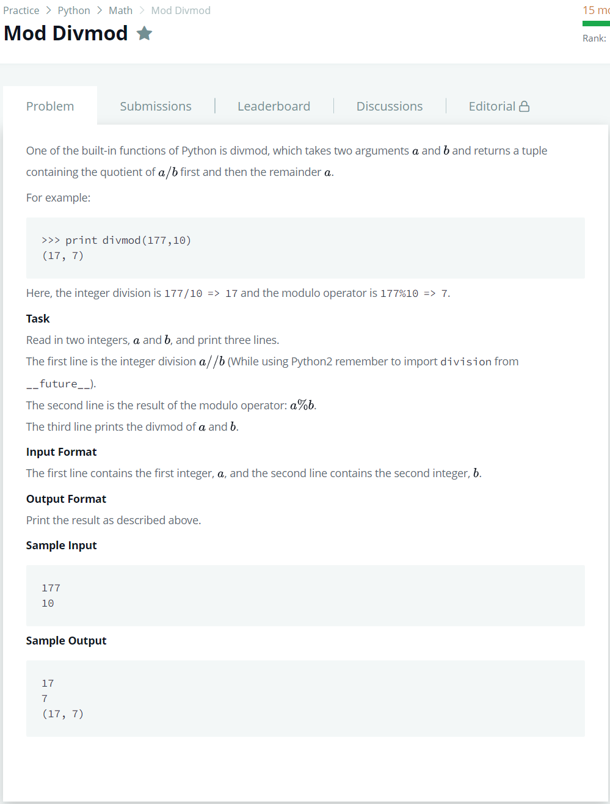

# [Mod Divmod](https://www.hackerrank.com/challenges/python-mod-divmod/problem)




### My Answer

```python
import sys

a = int(sys.stdin.readline())
b = int(sys.stdin.readline())

print(a//b)
print(a%b)
print(divmod(a,b))
```

* Time Complexity : O(1)
* Space Complexity : O(1)


### The things I got
