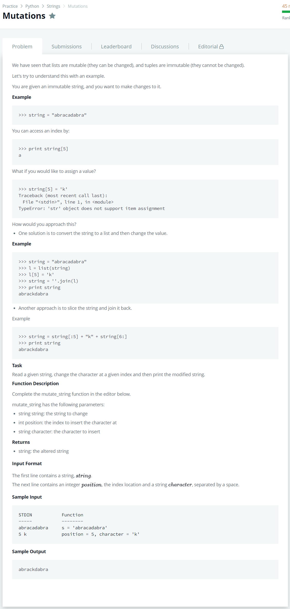

# [Mutations](https://www.hackerrank.com/challenges/python-mutations/problem?h_r=next-challenge&h_v=zen&h_r=next-challenge&h_v=zen)




### My Answer

```python
def mutate_string(string, position, character):
    return string[:position]+character+string[position+1:]
```

* Time Complexity : O(1)
* Space Complexity : O(1)


### The things I got
