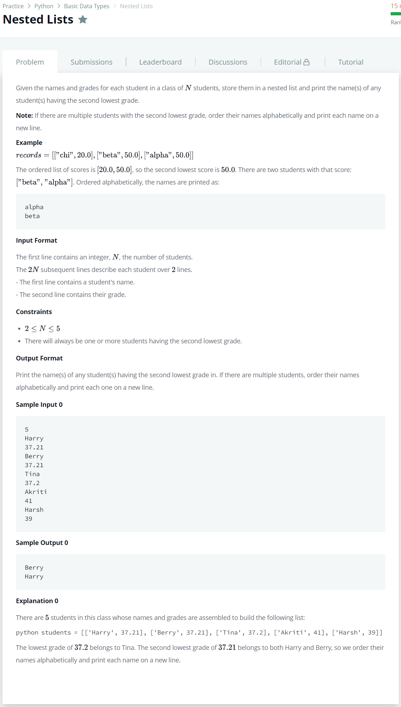

# [Nested Lists](https://www.hackerrank.com/challenges/nested-list/problem)




### My Answer

```python
if __name__ == '__main__':
    
    first_lowest = 1000
    second_lowest = 1000
    name_first = []
    name_second = []
    
    for _ in range(int(input())):
        name = input()
        score = float(input())
        
        if score<first_lowest : 
            if first_lowest<second_lowest : 
                second_lowest = first_lowest
                name_second = name_first[:]
            name_first = []
            first_lowest = score
            name_first.append(name)
        elif score==first_lowest : 
            name_first.append(name)
            continue
        elif score<second_lowest : 
            name_second = []
            second_lowest = score
            name_second.append(name)
        elif score==second_lowest : 
            name_second.append(name)
        else : continue
            
    [print(x) for x in sorted(name_second)]
```

* Time Complexity : O(n)
* Space Complexity : O(2n)


### The things I got
