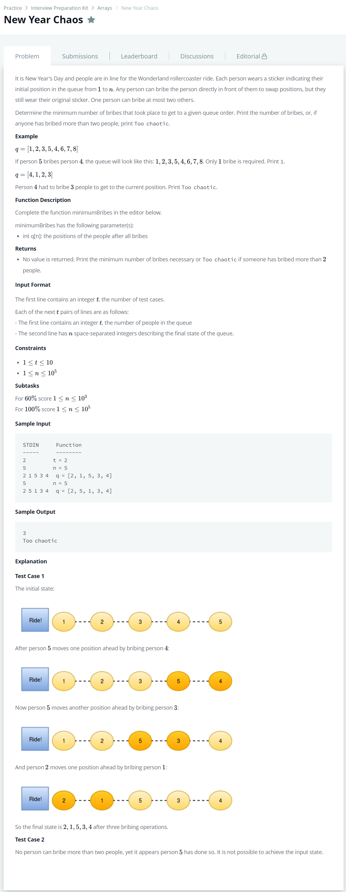

# [New Year Chaos](https://www.hackerrank.com/challenges/new-year-chaos/problem?h_l=interview&playlist_slugs%5B%5D=interview-preparation-kit&playlist_slugs%5B%5D=arrays)




### My Answer

```python
#bubble sort + defaultdict
def minimumBribes(q):
    count = defaultdict(int)
    for i in range(len(q)) : 
        flag=False
        for j in range(len(q)-1) : 
            if q[j]>q[j+1] : 
                count[q[j]]+=1
                q[j+1],q[j]=q[j],q[j+1]
                flag = True           
        # if not any swap
        if not flag : 
            break
    if max(count.values())>2 : 
        print('Too chaotic')
    else : 
        print(sum(count.values()))
```

* Time Complexity : O(n)~O(n^2)
* Space Complexity : O(2n)


### The things I got

