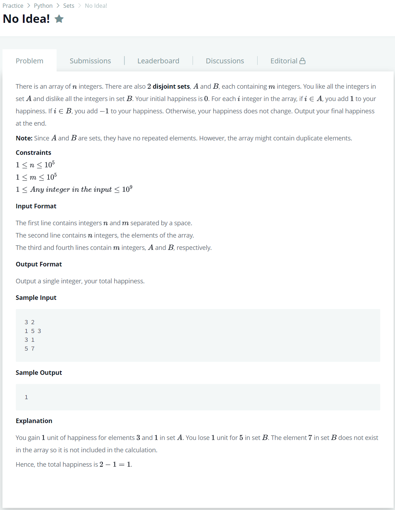

# [No Idea!](https://www.hackerrank.com/challenges/no-idea/problem)




### My Answer

```python
# Enter your code here. Read input from STDIN. Print output to STDOUT
input()
array = [int(x) for x in input().split(' ')]
A = set([int(x) for x in input().split(' ')])
B = set([int(x) for x in input().split(' ')])

happiness = 0
for x in array : 
    if x in A : happiness+=1
    elif x in B : happiness-=1
    else : pass
    
print(happiness)
```

* Time Complexity : O(n)
* Space Complexity : O(2n)


### The things I got
