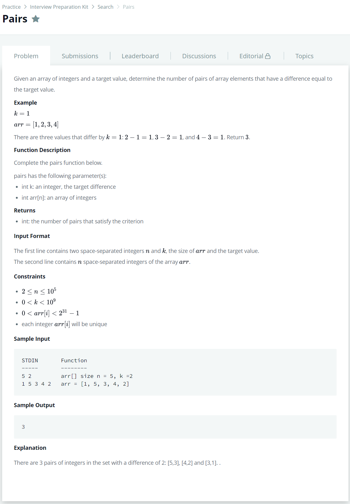

# [Pairs](https://www.hackerrank.com/challenges/pairs/problem)




### My Answer

```python
def pairs(k, arr):
    table = defaultdict(int)
    count=0
    for x in arr : 
        if table[x-k]==0 : 
            table[x]+=1
        else : 
            table[x]+=1
            count+=1
            
        if table[x+k]==0 : 
            table[x]+=1
        else : 
            table[x]+=1
            count+=1
    return count
```

* Time Complexity : O(n)
* Space Complexity : O(n)


### The things I got
